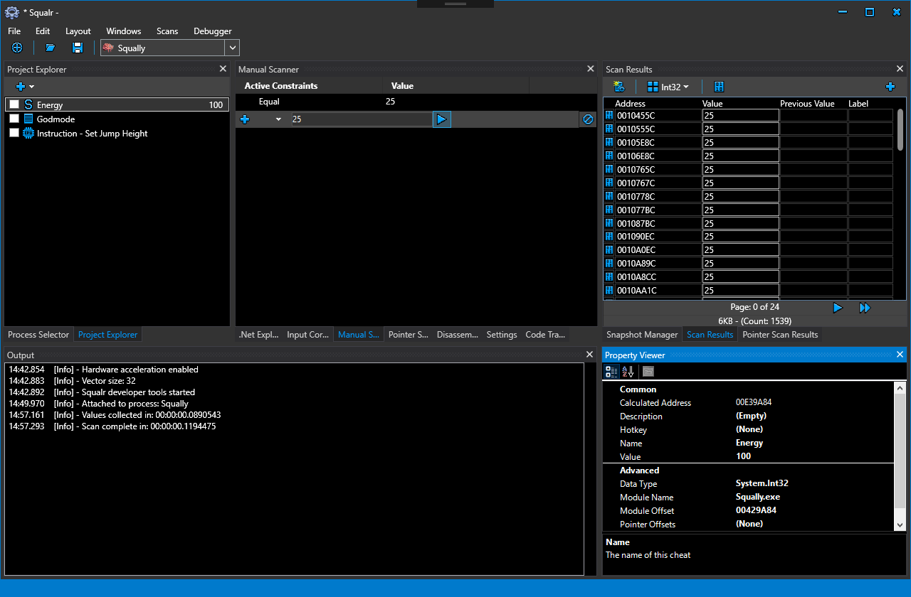

# Squalr

[](http://www.gnu.org/licenses/gpl-3.0)

[Squalr Official Website](https://www.squalr.com)

Join us on our [Discord Channel](https://discord.gg/Pq2msTx)

**Squalr** is performant Memory Editing software that allows users to create and share cheats in their windows desktop games. This includes memory scanning, pointers, x86/x64 assembly injection, and so on.

How does Squalr achieve fast memory scans in .NET? Multi-threading combined with single-core parallelism via SIMD instructions. See this article: [SIMD in .NET](https://instil.co/2016/03/21/parallelism-on-a-single-core-simd-with-c/). To take advantage of these gains, your CPU needs to have support for SSE, AVX, or AVX-512.



## Documentation

You can find detailed documentation on the [Wiki](https://squalr.github.io/SqualrDocs/). There are three ways to use Squalr:
- Front end GUI
- Scripting API
- Back end NuGet packages

Below is some brief documentation on the NuGet package APIs

### Receiving Engine Output:
If using the NuGet packages, it is important to hook into the engine's output to receive logs of events. These are invaluable for diagnosing issues.

```csharp
using Squalr.Engine.Output;

...

// Receive output from the engine
Output.Subscribe(new EngineLogEvents());

...

class EngineLogEvents : IOutputObserver
{
	public void OnLogEvent(LogLevel logLevel, string message, string innerMessage)
	{
		Console.WriteLine(message);
		Console.WriteLine(innerMessage);
	}
}
```

### Attaching The Engine
```csharp
using Squalr.Engine.OS;
...

IEnumerable<Process> processes = Processes.Default.GetProcesses();

// Pick a process. For this example, we are just grabbing the first one.
Process process = processes.FirstOrDefault();

Processes.Default.OpenedProcess = process;

```


### Manipulating Memory:

```csharp
using Squalr.Engine.Memory;

...

Reader.Default.Read<Int32>(address);
Writer.Default.Write<Int32>(address);
Allocator.Alloc(address, 256);
IEnumerable<NormalizedRegion> regions = Query.GetVirtualPages(requiredProtection, excludedProtection, allowedTypes, startAddress, endAddress);
IEnumerable<NormalizedModule> modules = Query.GetModules();
```

### Assembling/Disassembling:
Squalr can assemble and disassemble x86/x64 instructions, leveraging NASM.

```csharp
using Squalr.Engine.Architecture;
using Squalr.Engine.Architecture.Assemblers;

...

// Perform assembly
AssemblerResult result = Assembler.Default.Assemble(assembly: "mov eax, 5", isProcess32Bit: true, baseAddress: 0x10000);

Console.WriteLine(BitConverter.ToString(result.Data).Replace("-", " "));

// Disassemble the result (we will get the same instructions back)
IEnumerable<NormalizedInstruction> instructions = Disassembler.Default.Disassemble(bytes: result.Data, isProcess32Bit: true, baseAddress: 0x10000);

Console.WriteLine(instructions[0].Mnemonic);
```

### Scanning:
Squalr has an API for performing high performance memory scanning:

```csharp
using Squalr.Engine.Scanning;
using Squalr.Engine.Scanning.Scanners;
using Squalr.Engine.Scanning.Scanners.Constraints;
using Squalr.Engine.Scanning.Snapshots;

...

Snapshot snapshot = SnapshotManager.GetSnapshot(Snapshot.SnapshotRetrievalMode.FromUserModeMemory);

snapshot = ValueCollector.CollectValues(snapshot, dataType, null, out _).Result;

ManualScanner.Scan(
	SnapshotManager.GetSnapshot(Snapshot.SnapshotRetrievalMode.FromActiveSnapshotOrPrefilter),
	DataType.Int32,
	allScanConstraints,
	null,
	out _).Result
	
	
for (UInt64 index = 0; index < snapshot.ElementCount; index++)
{
	SnapshotElementIndexer element = snapshot[index];

	Object currentValue = element.HasCurrentValue() ? element.LoadCurrentValue() : null;
	Object previousValue = element.HasPreviousValue() ? element.LoadPreviousValue() : null;
}
```

### Debugging:

```csharp
// Example: Tracing write events on a float
BreakpointSize size = Debugger.Default.SizeToBreakpointSize(sizeof(float));
CancellationTokenSource cancellationTokenSource = Debugger.Default.FindWhatWrites(0x10000, size, this.CodeTraceEvent);

...

// When finished, cancel the instruction collection
cancellationTokenSource.cancel();

...

private void CodeTraceEvent(CodeTraceInfo codeTraceInfo)
{
	Console.WriteLine(codeTraceInfo.Instruction.Address.ToString("X"));
	Console.WriteLine(codeTraceInfo.Instruction.Mnemonic);
}
```
	
## Recommended Visual Studio Extensions
Reference | Description 
--- | ---
[XAML Formatter](https://marketplace.visualstudio.com/items?itemName=TeamXavalon.XAMLStyler) | XAML should be run through this formatter
[StyleCop](https://marketplace.visualstudio.com/items?itemName=ChrisDahlberg.StyleCop) | StyleCop to enforce code conventions. Note that we deviate on some standard conventions. We use the full type name for variables (ex Int32 rather than int). The reasoning is that this is a memory editor, so we prefer to use the type name that is most explicit to avoid coding mistakes.

## Build

In order to compile Squalr, you should only need **Visual Studio 2017**. This should be up to date, we frequently update Squalr to use the latest version of the .NET framework. Here are the important 3rd party libraries that this project uses:

Library | Description 
--- | ---
[EasyHook](https://github.com/EasyHook/EasyHook) | Managed/Unmanaged API Hooking
[SharpDisasm](https://github.com/spazzarama/SharpDisasm) | Udis86 Assembler Ported to C#
[CsScript](https://github.com/oleg-shilo/cs-script) | C# Scripting Library
[AvalonEdit](https://github.com/icsharpcode/AvalonEdit) | Code Editing Library
[SharpDX](https://github.com/sharpdx/SharpDX) | DirectX Wrapper
[CLRMD](https://github.com/Microsoft/clrmd) | .NET Application Inspection Library
[AvalonDock](https://avalondock.codeplex.com/) | Docking Library
[LiveCharts](https://github.com/beto-rodriguez/Live-Charts) | WPF Charts

## Planned Features

Library | Description | Purpose
--- | --- | ---
[AsmJit](https://github.com/hypeartist/AsmJit) | x86/x64 Assembler | Replace FASM, improve scripting drastically
[AsmJit](https://github.com/asmjit/asmjit) | x86/x64 Assembler | Original C++ project. May port/interop this if the above version does not work (Neither may fully work, and something custom may be needed)
[WpfHexEditorControl](https://github.com/abbaye/WpfHexEditorControl) | Hex Editor | Hex editor / Memory Hex Editor
[OpenTK](https://github.com/opentk/opentk) | OpenGL Wrapper | Graphics Injection
[SharpDX](https://github.com/sharpdx/SharpDX) | DirectX Wrapper | Graphics Injection (Currently using SharpDX just for input)
[SharpPCap](https://github.com/chmorgan/sharppcap) | Packet Capture | Packet Editor
[Packet.Net](https://github.com/antmicro/Packet.Net) | Packet Capture | Packet Editor